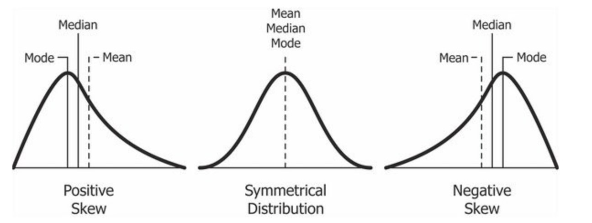

```{r setup, include=FALSE}
options(htmltools.dir.version = FALSE)
knitr::opts_chunk$set(
  message=FALSE, warning=FALSE, eval = TRUE, echo = FALSE, 
  fig.align = 'center', dev='svg'
)
```

```{r results='hide'}
library(tidyverse)
library(magrittr)
setwd("C:\\Users\\ahart\\Documents\\MeasuringCorr")
load('DCPS testing.rData')
```

class: inverse, center, middle

# WHAT IS A DATASET?

---
# Data vs dataset

- **DATA:** empirical information or observation

- **DATASET:** structured collection of data
  - Units `-` primary objects or entities under observation or study
  - Variables `-` measured characteristics of the units
  
- Examples:
  1. [Data I use constantly](https://www.google.com/search?client=firefox-b-1-d&q=premier+league+table#sie=lg;/g/11pz7zbpnb;2;/m/02_tc;st;fp;1;;;)
  2. [Tracking a river](https://waterdata.usgs.gov/nwis/uv?cb_00060=on&cb_00065=on&format=gif_stats&site_no=01642190&period=&begin_date=2022-09-05&end_date=2022-09-12)
  3. [Women in parliament](https://docs.google.com/spreadsheets/d/1sZkBcCiUvwX9JEmQhRiXg8SfEP--CxHlyJzoRNs-Hn4/edit#gid=993938300)


---
# DCPS PARCC Data

Partnership for Assessment and Readiness for College and Career Assessment 

- Assessment data for 108 DC public schools, 2017`-`2018  

- Records student proficiency (% at grade level)  
&zwnj; 

--

&zwnj; 


```{r show,}
dcps %<>%
  mutate(ProfLang = round(ProfLang,1), ProfMath = round(ProfMath,1)) %>%
  select(SchName, SchType,ProfLang,ProfMath)

  knitr::kable(dcps[1:5,], format="pipe", cap="The PARCC Data", padding=2)
```

---
# Know your variables

- **CATEGORICAL VARIABLE** Qualitative indicator of membership in distinct groups.

> `SchType`: Categorical variable for Elementary, Middle, or High school.

- **NUMERIC VARIABLE** A quantitative measure of amount or degree.

> `ProfLang`: Numeric record of the percentage of students reading at grade-level.


---
class: inverse, center, middle

# DESCRIBING DATA: one variable


---
class: center, middle

# Categorical data
Tabulating frequencies


---
# Frequencies

### How many units fall into each group?

- **Raw frequency** $(n_k)$: Number of observations in the data belonging to each category.
&zwnj;  

- **Relative frequency** $(\%)$: Raw frequency divided by total number of observations in the data

- **Modal category**: The most frequent group or value in the data.


---
# Presenting the analysis

### DCPS schools by level, 2017`-`2018
.pull-left[
```{r tabs}
  tab = 
    dcps %>%
    count(SchType) %>%
    transmute(
      `School Type` = SchType,
      Freq = n,
      `(%)` = round(100 * Freq/sum(Freq),digits = 1)
    )

  knitr::kable(tab, format = "pipe", padding = 4, cap = "FREQUENCY TABLE")
```
]

.pull-right[
```{r type, fig.width=5, fig.asp=1}
  barplot(`(%)` ~ `School Type`, data = tab,
          col = rgb(0.8,0.1,0.1,0.6),
          main = "BAR CHART", ylab = 'Freq (%)',
          cex.axis=1.5, cex.names=1.5, cex.lab=1.5, cex.main = 2.2)
```
]


---
class: center, middle

# Numeric data
Classic summary statistics


---
# Describing a distribution

### Basic statistics

- **Minimum**, $Y_{min}$: lowest recorded score of $Y$ in the data
- **Mean**, $\mu_{Y}$: simple average of recorded scores on $Y$
- **Median**, $Q_2$: value of $Y$ for the unit at the midpoint, or 50th percentile, of the ordered data.
- **Maximum**, $Y_{max}$: highest recorded score of $Y$


### Spread
- **Range**, $Y_{max} - Y_{min}$
- **Standard deviation**, $\sigma_Y$: average distance of the cases from the mean
- **IQR**, $Q_3 - Q_1$: range capturing the middle 50% of observed data


---
# Moments of a distribution

- **MEAN**, $\mu_{Y}$: average value of $Y$ in the data 
$$\mu_{Y}=\frac{\sum{Y_i}}{n}$$
Note: the mean is a balance point on the number line such that $\sum{(Y_i-\mu_{Y})} = 0$

- **STANDARD DEVIATION**, $\sigma_Y$: measure of dispersion
$$\sigma_Y = \sqrt{\frac{\sum{(Y_i-\mu_{Y})^2}}{n-1}}$$
Note: roughly equal to the average distance from the cases to the mean.


---
# Ex: describing a distribution

Across 108 DCPS schools, an average of `r mean(dcps$ProfLang) %>% round(digits = 1)` percent of students read at grade level. The standard deviation is `r sd(dcps$ProfLang) %>% round(digits = 1)`.  


```{r d1, fig.width = 9, fig.asp = .62}
hist(dcps$ProfLang, 
     main = "Language Proficiency, DCPS 2017", ylab = "Frequency", xlab = "Students at Grade Level (%)",
     col = 'cornflowerblue', cex.lab=1.5, cex.axis=1.5, cex.main=1.8, cex.sub=1.5)
```

---
# Rank statistics

### For severely skewed data

- **MEDIAN**, $Q_2$: value of $Y$ at the midpoint, or 50th percentile, of the ordered data.

- **INTERQUARTILE RANGE**, $Q_3 - Q_1$: range capturing the middle 50% of observed data


---
# Ex: rank stats remix

Across 108 DCPS schools, an average of `r median(dcps$ProfLang) %>% round(digits = 1)` percent of students read at grade level. The standard deviation is `r IQR(dcps$ProfLang) %>% round(digits = 1)`.


```{r d2, fig.width = 9, fig.asp = .5}

boxplot(dcps$ProfLang, horizontal = TRUE,
     main = "Language Proficiency, DCPS 2017",
     xlab = "Students at Grade Level (%)",
     ylim = c(0,100), col="#69b3a2",
     cex.lab=1.4, cex.axis=1.4, cex.sub=1.4,cex.main=1.8)

```


---
# Means, medians, and skew

- **SKEW**: Measure of a distribution's asymmetry; reflected in the divergence of the mean from the median.

```{r skews, out.width = '85%'}

```

- **IMPORTANCE**: For skewed distribution, the mean is a biased measure of central tendency.


---
class: inverse, center, middle

# MEASURING CORRELATIONS

---
# What is a correlation?

Given data on an exposure variable, $X$ and an outcome variable, $Y$...

> *Statistical independence*: you find no pattern of association between $X$ and $Y$. The distribution of $Y$ is unchanged across different values or categories of $X$.

> *Dependence/correlation*: there is a pattern of co-relation or co-occurence between $X$ and $Y$ in the data. The distribution of $Y$ changes systematically "depending" on the value of $X$. 

&zwnj; 


---
# Measuring correlations

### Simple linear dependence

- Correlation coefficient, $r_{xy}$: measures direction and degree of linear dependence $(-1 \leq r \leq 1)$.

### Models of the conditional mean

- Regression coefficient, $\beta$: estimated response in $Y$ for a one-unit increase in $X$

- Group comparisons (categorical exposure var)
  - For numeric $Y$: compare mean outcome across groups, e.g., $\mu_T - \mu_C$?
  - For categorical $Y$: compare the relative frequency of $Y$ within each group of $X$.


---
class: inverse, center, middle

# Linear regression


---
# The trends we see

### Looking for linear association

```{r corr, fig.width=4, fig.height=4, dpi=250}
  # 2. plot  
    plot(ProfLang ~ ProfMath, data = dcps) # scatter

```


---
# Definining a conditional mean

Model $Y$ as a linear function of $X$: 
$$
Y_i = \alpha + \beta (X_i) + e_i
$$

### Coefficients
- Intercept, $\alpha = E(Y|X=0)$
- Slope, $\beta = E(\Delta Y | \Delta X)$

> The slope, $\beta$, captures the expected effect of a change in $X$ on the mean of $Y$.


### The error term $e_i$
- vertical distance between point and line $Y_i - (\alpha + \beta(X_i))$
- reflects probabilistic nature of estimation

---
# The data, the line, the error

From DCPS testing data: 
$$
ProfLang_i = 4.3 + 0.94(ProfMath_i) +e_i
$$

  A one-point increase in math proficiency is associated with a 0.94-point increase in mean language proficiency.
  

```{r fit1, fig.width=4, fig.height=4, dpi=250}
# Scatter w/OLS fit (numeric X, numeric Y)
  # 1. store OLS estimates
    est = lm(ProfLang ~ ProfMath, data = dcps)
  # 2. plot  
    plot(ProfLang ~ ProfMath, data = dcps) # scatter
    abline(est, col = 'cornflowerblue') # add linear fit
```
]


---
# What to do with your regression?

$$
ProfLang_i = 4.3 + 0.94(ProfMath_i) +e_i
$$

- Estimate average response in $Y$ to unit-change in $Y$

>   A one-point increase in math proficiency is associated with a 0.94-point increase in mean language proficiency. 

- Predict average $Y$ for a given value of $Y$ 
$$
\begin{aligned}
E(Y_i|X_i=50) &= 4.3 + 0.94(50)\\
&= 4.3 + 47 \\
&= 51.3 \\
\end{aligned}
$$

---
# Is this causal?

> Correlation is a necessary but insufficient condition for causal inference.

- Beware! The leap from correlation to causation is treacherous.

- All/some/none of the relationship you identify may be evidence of the causal effect of $X$ on $Y$.


---
class: inverse, center, middle

# Computing in R/RStudio

Preparing for next week


---
class: inverse

# Be ready for R

### For next week

- Install R & RStudio on your computer

- Prep Survival Guide, Ch 1-5.2, and 6.1

- Workshop 1: Tesler, Intro and Ch 1


---
class: inverse, center, middle

# QUIZ: R skills builder quiz

Due by Wednesday, September 28.

Available on Canvas. Attempt the quiz up to five times.

